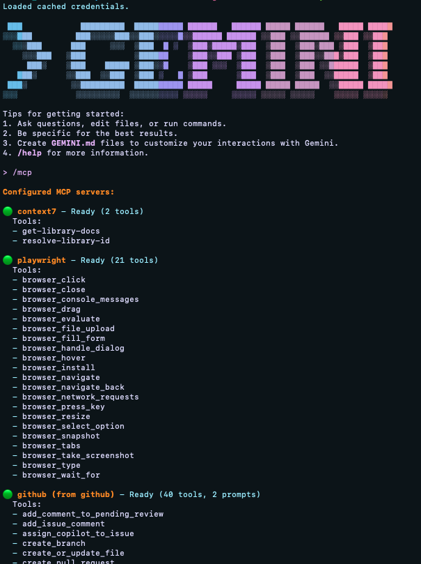

# 코딩 에이전트를 똑똑하게 사용하기 with MCP 서버

## 🎯 세션 목표

MCP(Model Context Protocol)를 활용하여 **문서 학습 → 계획 수립 → 테스트 작성 → 코드 리팩토링 → 검증 → PR 생성**에 이르는 전체 워크플로를 자동화합니다.

## 📚 사용할 MCP 서버

1. **Context7**: 최신 라이브러리 문서를 실시간으로 학습
2. **GitHub**: 이슈/PR 생성 및 관리 자동화
3. **PlayWright**: E2E 테스트 자동 생성 및 실행

## 🚀 시작하기

### 1. MCP 서버 설정

#### 1.1 기본 설정 확인

프로젝트의 `/.gemini` 폴더에 기본적인 Gemini CLI MCP 명세가 이미 구성되어 있습니다.

#### 1.2 MCP 서버 설치

터미널에서 다음 명령어를 실행하여 필요한 MCP 서버를 설치합니다:

```bash
# GitHub MCP 서버 설치
gemini extensions install https://github.com/github/github-mcp-server

# Context7 MCP 서버 설치
gemini extensions install https://github.com/upstash/context7
```

> **참고:** PlayWright MCP는 이미 `settings.json`에 명세되어 있습니다.

#### 1.3 환경 변수 설정

`/.gemini` 폴더 안에 `.env` 파일을 생성하고 필요한 API 키를 추가합니다:

##### Context7 API 키 발급

1. [Context7 웹사이트](https://context7.com/)에 접속하여 회원가입
2. 대시보드에서 API 키 발급
3. `/.gemini/.env` 파일에 다음 내용 추가:

```bash
CONTEXT7_API_KEY=your_context7_api_key_here
```

##### GitHub Personal Access Token (PAT) 발급

1. [GitHub PAT 생성 페이지](https://github.com/settings/personal-access-tokens/new)에 접속
2. 다음 권한 설정:
   - **Repository Access**: All repositories 선택
   - **Permissions**: Issues, Pull Requests 선택
3. 토큰 생성 후 `/.gemini/.env` 파일에 추가:

```bash
GITHUB_TOKEN=your_github_pat_here
```

##### 최종 .env 파일 예시

```bash
# /.gemini/.env
CONTEXT7_API_KEY=your_context7_api_key_here
GITHUB_TOKEN=your_github_pat_here
```

### 2. 의존성 설치

```bash
yarn install
```

### 3. 개발 서버 실행

```bash
yarn start
```

### 4. MCP 서버 연결 확인

Gemini CLI를 실행하고 `/mcp` 명령어를 입력하여 MCP 서버 연결 상태를 확인하세요.

다음 3개의 MCP 서버가 모두 표시되면 설정이 완료된 것입니다:

- **context7** - 최신 라이브러리 문서 학습
- **github** - GitHub 이슈/PR 관리
- **playwright** - E2E 테스트 자동화



## 📁 프로젝트 구조

```
client/
├── src/
│   ├── before/                  # 리팩토링 전 코드 (React 18 패턴)
│   │   ├── ProfileForm.jsx      # 폼 제출 처리 (useState 4개 사용)
│   │   └── TextGenerator.jsx    # AI 텍스트 생성 (수동 상태 관리)
│   ├── after/                   # 리팩토링 후 코드 (React 19 패턴)
│   │   └── (실습 중 생성됨)
│   ├── api.js                   # Mock API 함수
│   ├── ErrorBoundary.jsx        # 에러 처리용 컴포넌트
│   ├── App.jsx                  # 메인 앱 컴포넌트
│   ├── main.jsx                 # 진입점
│   └── index.css                # 스타일
├── tests/                       # 테스트 파일 (선택사항)
│   └── .gitkeep
├── PROMPTS_CHEATSHEET.md        # 프롬프트 치트시트
├── INSTRUCTOR_GUIDE.md          # 강사용 가이드
└── README.md                    # 이 파일
```

## 🍀 기초 실습: Context7로 문서 학습하기

### 목표

Context7 MCP를 사용하여 최신 라이브러리 문서를 학습하고 코드에 반영합니다.

### 프롬프트

```
c7을 이용해서 google/genai 라이브러리를 학습하고
텍스트 생성을 생성형 AI를 사용하도록 변경해줘
```

### 결과

- Context7이 google/genai 최신 문서를 가져옴
- Gemini가 문서 기반으로 코드를 업데이트

---

## 🧨 심화 실습: MCP 통합 워크플로

현재 `src/before/ProfileForm.jsx`를 React 19의 최신 문법으로 리팩토링하는 전체 워크플로를 진행합니다.

### Phase 1: React 19 문서 학습

**프롬프트:**

```
c7을 이용해서 React 19 문서를 학습해줘.
```

**결과:** Copilot이 React 19 최신 지식을 습득합니다.

---

### Phase 2: 계획 수립 및 이슈 생성

**프롬프트:**

```
현재 작업 중인 내용을 최신 react 문법을 이용해 리팩토링할 계획을 세우고
GitHub MCP를 이용하여 새로운 이슈로 만들어 줘.
```

**결과:**

- Copilot이 현재 파일 분석 후 리팩토링 계획 수립
- GitHub MCP가 자동으로 이슈 생성 (예: Issue #1)

---

### Phase 3: 테스트 작성

**프롬프트:**

```
이 폼의 동작을 검증할 PlayWright 테스트 코드를 만들어서
'tests/ProfileForm.spec.js' 파일로 저장해 줘.
```

**테스트 시나리오:**

- ✅ 폼이 정상적으로 렌더링되는지 확인
- ✅ 이름 입력 필드에 값 입력 가능한지 확인
- ✅ 저장 버튼 클릭 시 로딩 상태로 변경되는지 확인 (`aria-busy="true"`)
- ✅ 성공 메시지가 표시되는지 확인 (`data-testid="profile-success-message"`)
- ✅ 에러 시나리오 테스트 (빈 이름 제출 등)

**결과:**

- PlayWright를 사용한 E2E 테스트 생성
- tests/ProfileForm.spec.js 파일 자동 생성

---

### Phase 4: 코드 리팩토링

**프롬프트:**

```
ProfileForm을 최신 리액트 문법을 이용하여 리팩토링 진행해줘
그리고 완성된 파일을 App.jsx에 추가해줘
```

**리팩토링 체크리스트:**

- ✅ `useActionState`로 상태 관리 통합
- ✅ 기존 `data-testid` 속성 유지 (테스트 호환성)
- ✅ `aria-busy`, `role` 등 접근성 속성 유지
- ✅ 동일한 UI/UX 동작 보장

**결과:**

- Copilot이 계획에 따라 코드를 리팩토링
- `src/after/ProfileForm.jsx` 파일 생성
- App.jsx에 리팩토링된 파일 추가

---

### Phase 5: 리팩토링 검증

**프롬프트:**

```
PlayWright 테스트를 실행해서
리팩토링이 잘 됐는지 확인해 줘.
```

**검증 포인트:**

- ✅ Before 버전과 동일한 테스트가 After 버전에서도 통과
- ✅ 모든 `data-testid` 속성이 유지되어 테스트 코드 재사용 가능
- ✅ 사용자 경험(로딩, 에러, 성공 메시지)이 동일하게 작동
- ✅ React 19의 새로운 기능 활용으로 코드는 더 간결해짐

**결과:** PlayWright 테스트 실행 및 결과 확인

---

### Phase 6: PR 생성

**프롬프트:**

```
변경 사항을 커밋하고,
아까 만든 이슈와 연결해서 PR까지 올려 줘.
```

**결과:**

- GitHub MCP가 커밋 메시지 자동 생성
- 이슈와 연결된 PR 자동 생성

---

## 💡 핵심 포인트

- **Context7**: 최신 문서를 실시간으로 학습하여 AI에게 정확한 컨텍스트 제공
- **GitHub MCP**: 이슈/PR 관리 자동화로 워크플로 간소화
- **PlayWright MCP**: 자동 테스트 생성으로 리팩토링 안정성 확보

### Context7 진단 프롬프트

```bash
gemini -c context7 "React 19에서 useFormStatus를 사용했는데 'pending' 상태가 업데이트되지 않아. 내 코드를 확인하고 React 19 문서를 바탕으로 이유를 설명해줘. (파일:./src/broken/ProfileForm_broken.jsx)"
```

## 🎉 최신 기능 테스트: React 19.2

### Context7의 최신 정보력 증명

```bash
gemini -c context7 "방금 릴리스된 React 19.2 (2025년 10월)의 새로운 기능인 '<Activity />' 컴포넌트에 대해 설명해줘. 어떤 문제를 해결하기 위해서 사용하는 거야?"
```

## 💡 핵심 메시지

### MCP로 해결하는 "지식의 격차(Information Gap)"

#### 문제점: 기존 AI의 한계

- **고정된 지식**: 학습 데이터의 특정 시점에 갇혀 있음
- **최신 정보 부족**: 새로운 라이브러리 버전, API 변경사항을 모름
- **수동 업데이트**: 개발자가 직접 최신 문서를 찾아 제공해야 함

#### 해결책: MCP를 통한 실시간 컨텍스트 연결

- **Context7**: 최신 라이브러리 문서를 실시간으로 학습
- **GitHub**: 코드 변경 이력과 이슈를 자동으로 추적
- **PlayWright**: 테스트 자동화로 리팩토링 안정성 보장

#### 결과: 진정한 AI 페어 프로그래밍

MCP는 단순한 도구가 아닌, **AI에게 실시간 지식을 제공하는 파이프라인**입니다.  
이를 통해 AI는 최신 베스트 프랙티스를 적용하고, 신뢰할 수 있는 코드를 생성할 수 있습니다.

---

### 참고

- context7을 gemini-cli에 연결하는 법: https://github.com/upstash/context7
- Gihub MCP를 gemini-cli에 연결하는 법: https://github.com/github/github-mcp-server/blob/main/docs/installation-guides/install-gemini-cli.md
